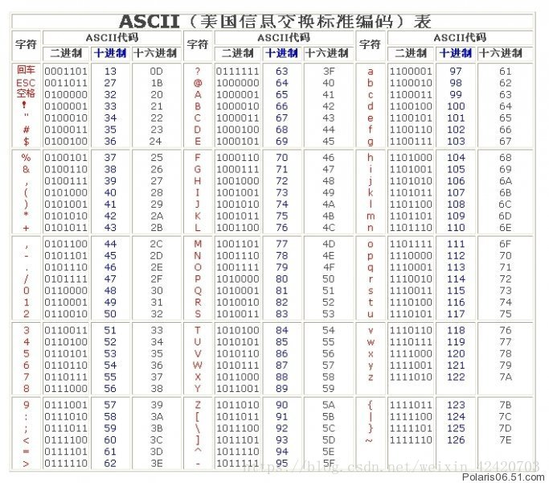

# base64 详解 
## 目录
- 什么是base64
- base64 如何编码
- base64 如何解码

## 正文
### 什么是base64？
以64个字符作为基本字符集（A-Z，a-z, 0-9, +, /）,此外还包含一个‘=’用作填充的字符（所以，总得来表示的话，总共有65个，但‘=’仅仅是在字符不够的情况下用于填充）。在基本字符集的基础纸上，用于表示其他字符。

### base64的编码规则
步骤如下：
1. 将原字符串由左往右，每三个字符划分为一组，最后不足三个的话，也划分为一组；
2. 将每个字符 通过ascii码，查找对应的十进制值，再将十进制转换成二进制，一共氛围24个二进制位；
3. 将24个二进制分为4组，每组6个，然后在每组的前面各加2个0，是每组变成8个二进制位，即4个字节；
4. 将4组的二进制转换成十进制，然后在下面的base64表中，找到对应的字符，即base64编码的值

#### base64表
| ASCII值 | 符号 | ASCII值 | 符号 | ASCII值 | 符号 | ASCII值 | 符号 |
| :-: | :-: | :-: | :-: | :-: | :-: | :-: | :-: |
| 0  | A | 1  | B | 2  | C | 3  | D |
| 4  | E | 5  | F | 6  | G | 7  | H |
| 8  | I | 9  | J | 10 | K | 11 | L |
| 12 | M | 13 | N | 14 | O | 15 | P |
| 16 | Q | 17 | R | 18 | S | 19 | T |
| 20 | U | 21 | V | 22 | W | 23 | X |
| 24 | Y | 25 | Z | 26 | a | 27 | b |
| 28 | c | 29 | d | 30 | e | 31 | f |
| 32 | g | 33 | h | 34 | i | 35 | j |
| 36 | k | 37 | l | 38 | m | 39 | n |
| 40 | o | 41 | p | 42 | q | 43 | r |
| 44 | s | 45 | t | 46 | u | 47 | v |
| 48 | w | 49 | x | 50 | y | 51 | z |
| 52 | 0 | 53 | 1 | 54 | 2 | 55 | 3 |
| 56 | 4 | 57 | 5 | 58 | 6 | 59 | 7 |
| 60 | 8 | 61 | 9 | 62 | + | 63 | / |

#### 例子： “don” 
1. 三个一组 -> don  
2. 转换成二进制  
  d: ASCII值 100， 二进制为0110 0100  
  0: ASCII值 111， 二级制为0110 1111  
  n: ASCII值 110， 二进制为0110 1110  
3. 24个二进制位6个一组，可以分为4组， 每组开头再补充两个0，组成32个二进制位  
  24个：0110 0100 0110 1111 0110 1110  
  分为四组，并开头补充0：0001 1001 00000 0110 0010 1110
4. 将二进制转换成十进制，查找对应的base64值  
  对应的十进制值为： 25， 6， 60， 46  
  对应的base64为：ZG8u

#### 如果不足3个字符s
主流程不变，还是转换成二进制，6个二进制位分为一组，最后一组不够6个，就用0补充
### 例如：只有两个字符 “do”
- 转成二进制 0110 0100 0110 1111
- 6个一组，可以分为三组（6，6， 4），最后一组，尾部用2个0补充成6个二进制位：011001 00111 111100，在每组开头补充两个0，00011001 00001111 00111100
- 二进制转换成十进制：25， 15， 30，对应的base64值为 ZGe, 
- 为补充成4个base64一组，尾部再加个=， 所以，最终的值为ZGe=

#### 另一个例子，只有一个字符 ‘d’
主流程不变，6个一组，不够6个，尾部用0补充；三个字符，缺n个字符，转成的base64尾部就有n个=

### 如何解码？
编码的逆过程：
1. 每4个字符一组，查找base64表，找出对应的ASCII值
2. 将十进制转换成二进制，并去掉每组开头的00
3. 将剩下的24个二进制位分成3组，分为3个字节
4. 查找ASCII表，找到每个字节对应的字符

ASCII表：

  

